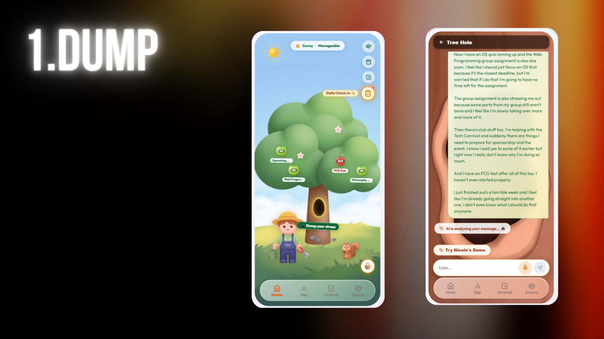
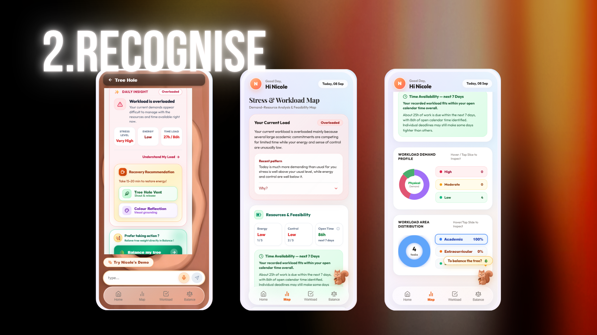
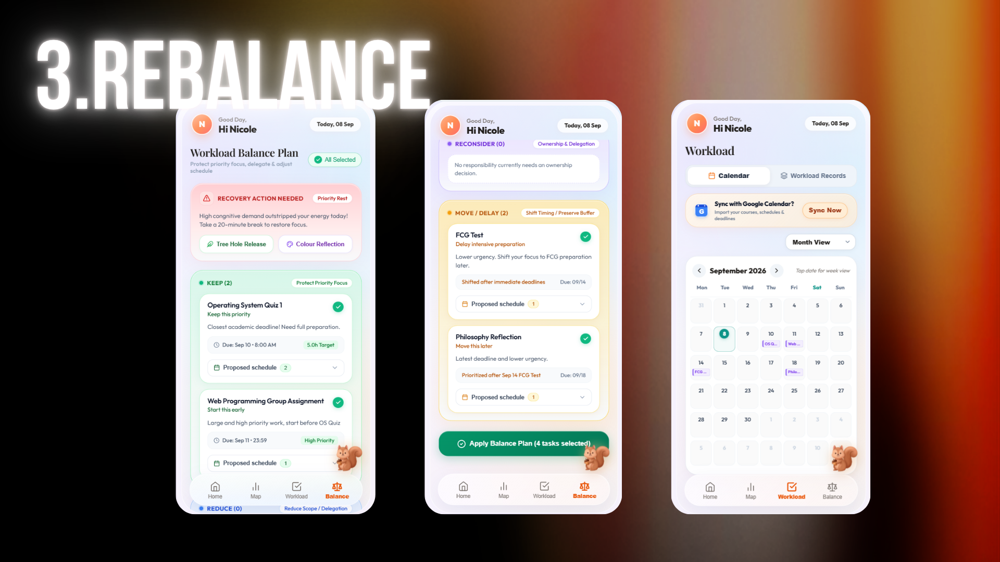
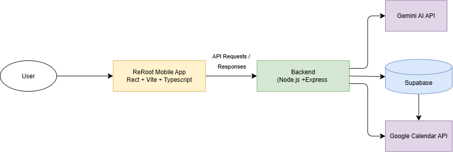

# 🌱 ReRoot by Chilli PanMee

**Team:** Nicole Lee · Crystal Yap Wen Jing  
**Problem Statement:** Stress & Workload Manager  
🎥 **Video Presentation:** https://youtu.be/y8J-EQBxr4Q  
📊 **Presentation Slides:** https://canva.link/1mewsuir2oo7zmh

---
## 📌 Table of Contents

- [1. Project Overview](#project-overview)
  - [The Problem](#the-problem)
  - [Our Solution](#our-solution)
  - [Core Features](#core-features)
  - [Supporting Features](#supporting-features)
- [2. Ideation & Process](#ideation-process)
  - [2.1 Evolution of Our Idea](#evolution)
  - [2.2 Ideas We Considered](#ideas-considered)
  - [2.3 Mentor Consultation](#mentor-consultation)
- [3. Design & Prototype](#design-prototype)
- [4. What Makes It Different](#different)
- [5. Technical Architecture & Feasibility](#technical)
---

# 1. Project Overview

## 💭 The Problem

University students often juggle classes, assignments, examinations, extracurricular responsibilities, social commitments and personal needs at the same time. When these demands accumulate, the problem becomes more than simply having **“too much to do.”** Students can lose the mental space to step back, understand their overall condition, recognise when their workload is becoming unsustainable, and decide what should actually change. Instead, they may simply react to whichever task feels most urgent and continue pushing through limited time and energy. This can lead to **poor prioritisation, ignored mental and physical strain, and an increasingly unsustainable workload.**

### 🎯 Our Target Users

> <i>**University students managing multiple overlapping commitments, especially those who are still trying to keep everything running but are beginning to feel overloaded.**</i>

### ❓Where Existing Solutions Fall Short

Existing tools often address only one side of the problem.

| Productivity Tools | Mental Wellness App |
| --- | --- |
| Example: **Todoist** | Example: **Headspace** |
| Organise tasks, schedules and deadlines | Support mindfulness, stress management and emotional wellbeing |

However, when stress comes from an imbalance between a student's workload and the resources they currently have available, the key question remains:

> “Given what I am carrying right now, what should actually change within what I can realistically handle?”**

**Let's see how ReRoot is designed around this gap!** 
   
## 🌱 Our Solution

ReRoot is a stress and **workload decision-support app** that represents the user's situation as a **living virtual garden.**

It combines **workload information, daily self-reported state and natural stress-dump conversations** to help determine whether the user's current situation is: 

**🟢 Manageable · 🟡 Strained · 🔴 Overloaded**

Instead of asking an already overwhelmed student to organise and analyse everything manually, ReRoot helps turn unstructured thoughts into clearer information and actionable guidance. It then helps the user decide what should **stay, move, change or pause**.

### Core Experience

> **Dump → Recognise → Rebalance**

 

## ✨ Core Features

### 1. Interactive Garden 🌳

The garden gives users an immediate visual overview of their current condition.

| Garden Element | Meaning |
| --- | --- |
| 🌳 **Tree condition** | Workload state: manageable, strained or overloaded |
| ☀️🌥️🌧️ **Weather** | Current stress level |
| 🍎 **Apples** | Workload records |
| 🧑‍🌾 **Gardener** | The user |

Instead of starting with numbers and dashboards, users can first **recognise their condition at a glance**.

### 2. Tree Hole & Squirrel AI Companion 🕳️🐿️

The **Tree Hole** is a chatroom where users can dump stressful thoughts naturally without organising everything first.

The Squirrel AI provides **contextual explanations and assistance**, helping users understand their current situation and adjust their workload or plans accordingly. It remains available throughout ReRoot as a **floating AI companion**, supporting users whenever they need guidance.

### 3. Balance Planner 📝

The Balance Planner turns understanding into **decisions**.

Instead of only telling users that they are overloaded, ReRoot helps them review what should be:

<i>**Keep · Delay · Reconsider · Reduce · Remove · Recover**</i>

The planner considers **deadlines, workload demands, available time, user condition and available resources**.

 

## 🧩 Supporting Features

| Feature | Purpose |
| --- | --- |
| **Daily Check-In** | Captures perceived stress, control, mental demand, coping confidence, emotion and energy |
| **Stress & Workload Analysis Map** | Provides deeper analysis of stressors, demands, workload distribution, feasibility and trends |
| **Workload Records & Calendar** | Provides structured workload and scheduling information |
| **Recovery Activities** | Optional Tree Vent and Colouring Reflection activities when recovery is needed |

 

---

<strong>FROM THE PROBLEM → TO HOW REROOT EVOLVED</strong>

---
 

# 2. 🧠 Ideation & Process

## 2.1 Evolution of Our Idea

ReRoot did not begin as a virtual garden. It evolved through multiple rounds of **discussion → research → mentor feedback → prototyping → refinement**.

Throughout the process, we kept asking:

> <i>“How can we help an overwhelmed student not only feel better, but actually understand what is happening and decide what should change?”</i>

 

<strong> 🚩 Stage 1 — <i>Two Different Starting Directions</i></strong>

 

### Stage 1
Our ideas start from two perspectives. 

#### 📋 A) Workload & Decision-Making

We noticed that students may understand every individual task, yet lose sight of their overall condition once everything piles up. Our initial flow was: 

Dump → Understand → Reality Check → Balance → Recover

The aim was to understand what was weighing on the user, compare demands with available resources and help them decide what to do next.

#### 💭 B) Emotional Support & Stress Relief

Our second direction explored:
- AI chat companion,
- personalised AI comics,
- colouring,
- Tree Hole stress release,
- music recommendations,
- community sharing.

Neither direction was enough on its own. We decided to create an app that **connect a student's workload with their current state** instead of treating work and wellbeing as two separate problems.
  

<strong> 🚩 Stage 2 — <i>Turning “Balance” Into a Structured Concept</i></strong>

 

### Stage 2
Our next question was: **What do stress, capacity and balance actually mean?**

🚫We could not assume: **More tasks = more stress.**

People can experience the same workload differently depending on their coping ability, energy, control, recovery and available resources.

We therefore researched:
- **Job Demands–Resources (JD-R) Model**
- **Transactional Model of Stress and Coping**
- **Conservation of Resources (COR) Theory**
- **Effort–Recovery Model**

Using the **JD-R model** as one of our main references:

> Demands = what the user currently has to handle  
> Resources = what the user currently has available to cope with those demands

#### JD-R Concept Diagram

*How the relationship between demands and resources informed ReRoot's concept.*

[🔗 View full JD-R diagram](https://drive.google.com/file/d/1DnkpBYxexwNB_klci1oWHfKYPyO7hpM3/view?usp=sharing)

We also recognised that **perceived stress matters**. A workload can appear manageable on paper while still feeling overwhelming to the person carrying it.

> <i>**Key shift:** We stopped looking only at how much work a user has and started considering the relationship between **demands, resources and perceived stress**.</i>

 

<strong> 🚩 Stage 3 — <i>Turning Theory Into App Inputs</i></strong>

 

### Stage 3
Theory alone was not enough. We needed realistic ways to collect meaningful information **without asking overwhelmed users to complete long assessments every day**. We therefore translated the concepts from our research into lightweight app inputs:

| **App Input** | **Purpose** | **What It Provides** |
| --- | --- | --- |
| 📝 **Daily Check-In** | Understand the user's current subjective condition | Perceived stress, control, mental demand, coping confidence, emotion and energy |
| 💬 **Stress Dump Chat** | Surface concerns without requiring users to organise everything first | Possible workloads, major stress sources and demands identified from natural conversation |
| 📋 **Workload Records** | Understand the demands the user is currently carrying | Deadlines, estimated effort, flexibility and different types of workload demand |
| 📅 **Calendar Context** | Understand real scheduling constraints | Existing commitments, available time and scheduling context |

The **Daily Check-In** was inspired by an EMA-adapted Perceived Stress Scale, while **NASA-TLX concepts** were referenced when considering workload assessment.

 

### 🔥 Our First Complete System

> **Daily Check-In + Stress Dump + Workload Records + Calendar → Analysis → Workload Management / Recovery**

At this stage, ReRoot had become structured enough to:
- collect information,
- analyse the user's situation from multiple perspectives,
- suggest possible actions.

But another problem appeared...
**We had too many features.**🤯

 

<strong> 🚩 Stage 4 — <i>From Many Features to One Clear Purpose</i></strong>

 

### Stage 4
**After Mentor Consultation #1**, we realised that **adding more solutions did not automatically make ReRoot stronger**. Some features were interesting, but they distracted from the main question:

> <i>“What should the user actually do when their current situation is no longer sustainable?”</i>

So we reduced the scope.

| Decision | Features | Why |
| --- | --- | --- |
| ❌ **Dropped** | AI Comic | Interesting emotionally, but had a weaker connection to the core workload-balancing problem |
| 🌿 **Kept as Optional** | Tree Vent, Colouring Reflection | Useful for recovery but not central to the main decision-support flow |
| 💪 **Strengthened** | Balance Planner | Directly helps users turn analysis into decisions and action |

The Balance Planner helps users decide whether something should be:

**<i>Keep · Delay / Move · Reconsider · Reduce · Remove · Recover**</i>

Rather than looking only at urgency and importance, ReRoot also considers the user's current condition and resources.

> **Key shift:** Analysis should not be the final output. Analysis should lead to a decision.

 

<strong> 🚩 Stage 5 — <i>Complete, But Not Yet Distinctive</i></strong>

 

### Stage 5
With these decisions made, we began building the prototype. Our system now consisted of:

- Daily Check-In
- Stress Dump
- Workload Records 
- Analysis
- Balance Planning
- Recovery

Functionally, the concept worked. However, after our second mentor consultation we identified another weakness... ReRoot had useful functions, but the experience **did not yet have a strong identity that made it immediately memorable.**

The prototype still felt like a collection of:

`dashboards` + `cards` + `charts` + `analysis` + `planning tools`

So we began rethinking **how users should experience the system**, rather than changing the underlying logic.

 

<strong> 🚩 Stage 6 — <i>From Dashboard to a Living Ecosystem 🌳</i></strong>

 

### Stage 6
During earlier brainstorming, we noticed similarities between **apple-tree growth cycles🍎** and sustainable workload management.

When an apple tree carries too much fruit, it consumes significant resources. Orchard management practices such as **fruit thinning** reduce excessive load and help support healthier long-term growth.

This inspired the visual metaphor for ReRoot.

| Apple Tree | ReRoot |
| --- | --- |
| 🍎 Apples | Workload records |
| 🌳 Tree condition | Overall workload state |
| ☀️🌧️ Weather | Stress level |
| 🧑‍🌾 Gardener | User |
| ✂️ Fruit thinning | Reduce, delay or remove unnecessary workload |
| 🌱 Recovery | Restore resources before taking on more demand |

#### Original Apple-Tree Brainstorm

*Our brainstorming around the apple-tree sustainability metaphor.*

[🔗 View full brainstorm](https://drive.google.com/file/d/1O8Q2ZJqxIsL7SMV8dMNYccr076AuLjxF/view?usp=sharing)

The old dashboard-style homepage became an **interactive living garden!** The garden also connected previously separate features into one experience:
- The original **Tree Hole release idea** became the **Tree Hole Chatroom**
- The original chatbot became the **Squirrel AI Companion**
- The tree became a visual representation of workload condition
- Weather became a visual representation of stress

The squirrel now stays with the user throughout ReRoot to:

**Listen → Explain → Answer → Guide**

We deliberately kept the metaphor simple rather than turning ReRoot into a full game. Detailed analysis and planning remain available when users want to go deeper.

 

<strong> 🌱 Final Direction — <i>Dump, Recognise, Rebalance</i></strong>

 

### Final 
Throughout this process, ReRoot evolved from a broad collection of stress and task-management ideas into a **decision-support system**.

| Stage | Purpose |
| --- | --- |
| 🕳️ **Dump** | Express what is happening without organising everything first |
| 🌳 **Recognise** | See the current state while AI and deeper analysis explain what contributes to it |
| ⚖️ **Rebalance** | Decide what to keep, move, reduce, reconsider or recover from |

### Detailed User Flow

[🔗 **View our detailed ReRoot user flow**](https://drive.google.com/file/d/1O5Q74aSra-o3s00Z0CBu8FnmH1LWOup7/view?usp=sharing)

---

> *ReRoot is not designed to push students to complete as much as possible. It helps them recognise when their current way of working is becoming unsustainable, step outside the immediate chaos, and make better decisions about what they can realistically carry.*

 

 

 

## 2.2 Ideas We Considered

We focused on one main goal throughout our refinement:

> <i>Help users recognise overload and make better decisions about what should change.</i>

Ideas that directly supported this goal were **kept, strengthened or redesigned**. Others were reduced to supporting features or removed to keep ReRoot focused and feasible.

| **Idea** | **Decision & Reason** |
| --- | --- |
| **Stress Dump Chat** | ✅ **Kept & Redesigned — Core** We kept it as an easy entry point for users to express stressful thoughts without organising everything first. AI identifies possible workloads, stressors and demands. It later evolved into the **Tree Hole Chatroom**. |
| **Balance Planner** | ✅ **Kept & Strengthened — Core** Analysis alone does not solve the problem. The Balance Planner turns insights into decisions and guides users toward the next action. |
| **Interactive Garden** | ✨ **Added — Core** Provides an interactive visual representation of the user's state and connects previously separate features into one cohesive experience. |
| **Squirrel AI Companion** | ✨ **Added — Core** The AI originally existed only inside Stress Dump Chat. We expanded it into a persistent companion that provides explanations, answers questions and guides users throughout ReRoot. |
| **Stress & Workload Analysis** | ✅ **Kept — Strong Supporting Feature** Provides deeper perspectives on major stressors, workload demands, time feasibility and trends. We kept the detailed analysis behind the simpler garden overview so users can explore it when needed without being overwhelmed immediately. |
| **Daily Check-In** | ✅ **Kept — Supporting Feature** Provides lightweight self-reported information about stress, control, mental demand, coping confidence, emotion and energy without requiring a long daily assessment. |
| **Workload Records** | ✅ **Kept — Supporting Feature** Structured workload information is necessary for understanding demands and generating realistic analysis and planning recommendations. |
| **Calendar Integration** | ✅ **Kept — Supporting Context** Provides additional context about existing commitments, available time and scheduling constraints to improve planning feasibility. |
| **Tree Hole Vent** | 🌿 **Kept — Optional Recovery Feature** A simple stress-release interaction where users can shout and trigger animations. It remains optional because it supports emotional release but is not central to workload balancing. |
| **Colouring Reflection** | 🌿 **Kept — Optional Recovery Feature** Provides a simple pause and recovery activity, so it remains a secondary feature rather than part of the main decision-support flow. |
| **AI-Generated Comic** | ❌ **Dropped** The comic aimed to turn the user's situation into an encouraging story and provide emotional support. However, it required more complex implementation, had a weaker connection to the core workload-balancing problem and risked distracting from the main solution. |
| **Community Sharing** | ❌ **Dropped** Community interaction could provide emotional support, but it expanded the scope without strongly contributing to ReRoot's main decision-support purpose. |
| **Music Recommendations** | ❌ **Dropped** Music could support relaxation, but it was a relatively generic wellness feature and contributed less to the core purpose compared with other ideas. |

 
 

## 2.3 🤝 Mentor Consultation

### Mentor Feedback 

<strong>🧑‍🏫 Mentor Session 1 — Marcus Mah Qing Fung  📅 2/9/2026 </strong>

### 💬 Feedback Received

**Comments**
- Reduce some features.
- Users may overestimate the effort required for a workload. The app should help them reconsider how much work is actually needed.
- UI/UX is important; use stronger UI components and reference platforms such as Dribbble and Motion.

**Suggestions**
- Connect the AI chatbot with other features in the app.
- Structure the prototype demo as **scenario → solution → impact**.
- Record the product and present it clearly in the demo.
- Consider a Progressive Web App instead of a native mobile app.

**For Later Phases**
- If we expand beyond university students, frame this as future scalability rather than changing the current target user.

### 🔧 What We Changed

- ❌ Removed the **AI Comic** feature.
- 📋 Added **subtask recommendations and records** so users can better estimate how much work a workload may require.
- 🔗 Connected the **AI Stress Dump Chat** to other features such as **Map, Balance and Recovery**.
- 🎛️ Improved UI components by using more visual and interactive controls rather than relying mainly on text-field input.
- 🌐 Decided to use **Vercel / Netlify** for prototype deployment during this phase.

<strong>🧑‍🏫 Mentor Session 2 — Sim Hong Bin  📅 9/9/2026 </strong>

### 💬 Feedback Received

**Comments**
- The app contained too much text.
- The UI was clean but could make better use of icons and visual elements.
- The solution was functional, but nothing immediately stood out as distinctive.

**Suggestions**
- Consider adding a **character or mascot**.
- Add more **real-time interaction**, including AI responses throughout the user experience.
- Focus the presentation on only **2–3 main features** to avoid confusing judges.
- Add something that improves user experience and gives the product a stronger identity.
- Refine the product with a more competition-focused mindset.

### 🔧 What We Changed

- 🌳 Built the **interactive garden ecosystem** to visualise the user's condition.
- 🐿️ Introduced the **Squirrel AI Companion**, which stays with users throughout the ReRoot journey and can provide contextual responses and guidance.
- 🎬 Restructured the demo to focus on a small number of strong core features and follow a clearer **scenario → solution → impact** flow.
- 👁️ Reduced reliance on text-heavy interfaces and strengthened visual interaction.

> **Notes:** The first mentor session helped us **reduce and connect the system**, while the second pushed us to make ReRoot **more distinctive, visual and competition-focused**.
  

# 3. 🎨 Design & Prototype

### UI Prototype

🌐 **Live Prototype:** https://codenection-chi.vercel.app

The following screenshots demonstrate the three main processes of ReRoot:

**Dump → Understand → Rebalance**

### 🕳️ 1. Dump

Users enter the **Tree Hole** to freely express their stressful thoughts, workload or concerns through natural conversation with the Squirrel AI.

  

### 🌳 2. Recognise

ReRoot analyses the information provided by the user and helps them understand their current workload, stress level and overall condition.

  

### ⚖️ 3. Rebalance

Based on the user's current condition and workload, the **Balance Planner** helps users decide what actions they can take to better manage their workload.

Users can consider different actions:

- **Keep** – Continue the task when it is still manageable.
- **Delay** – Move the task to a later time when appropriate.
- **Reconsider** – Think about whether the task is still necessary or worth prioritising.
- **Reduce** – Decrease the scope or amount of work.
- **Remove** – Remove tasks that are unnecessary.

  

---

# 4. 🌟 What Makes It Different

ReRoot focuses on whether a user's workload is **sustainable based on their current capacity**, rather than simply encouraging them to complete more tasks.

Instead of treating stress, workload and wellbeing as separate problems, ReRoot examines the relationship between **demand, stress and capacity**. This helps users recognise when they should rebalance their responsibilities, reduce their workload or take time to recover.

The following comparison highlights the key features that differentiate ReRoot from existing solutions such as **Headspace** and **Todoist**:

| **Features** | **ReRoot** | **Headspace** *(Mood / Wellness Manager)* | **Todoist** *(Task Manager)* |
| --- | :---: | :---: | :---: |
| **Workload Management & Adjustment** | ✅  | ❌  | ✅  |
| **Demand vs. Capacity Analysis** | ✅  | ❌  | ❌ |
| **AI Support** | ✅  | ✅  | ✅  |
| **Emotional Recovery** | ✅  | ✅  | ❌  |
| **Workload Balance Planning** | ✅  | ❌  | ❌  |
| **Calendar Integration** | ✅  | ❌  | ✅  |
| **Stress / Burnout Risk Visualisation** | ✅  | ❌  | ❌  |
| **Ecosystem Visualisation** | 🌳 Garden | 📊 Charts / Wellness Views | ❌  |

> **Key difference:** ReRoot does not simply ask *“What tasks should I complete?”* or *“How can I feel better?”*  
> It asks: **“Given what I am carrying and what I currently have available, what should change?”**

 

---

## 4.1 🌳 Ecosystem Visualisation of User Condition

ReRoot uses an **interactive garden ecosystem** to provide a visual representation of the user's current workload, stress and overall condition.

Instead of presenting the user with numbers and charts immediately, the garden allows users to **recognise their condition at a glance**.

Different elements of the ecosystem represent different aspects of the user's current state:

| **Element** | **Category** | **Element Condition** | **State / Meaning** |
| --- | --- | --- | --- |
| 🍃 **Leaves** | Daily State | Green and healthy leaves | 🟢 **Manageable** |
| 🍃 **Leaves** | Daily State | Yellow leaves | 🟡 **Strained** |
| 🍂 **Leaves + Broken Branches** | Daily State | Yellow leaves and broken branches | 🔴 **Overloaded** |
| ☀️ **Weather** | Stress Level | Sunny | 🟢 **Low** |
| ☁️ **Weather** | Stress Level | Cloudy | 🟡 **Moderate** |
| 🌧️ **Weather** | Stress Level | Rainy | 🔴 **High** |
| 🍏 **Apple** | Workload | Green apple — progress < 50% | Workload in progress |
| 🍎 **Apple** | Workload | Red apple — progress ≥ 50% | Higher workload progress |
| 🌳 **Tree** | Workload Balance | Tilting tree | ⚖️ **Workload needs balancing** |

### 🌱 Why the Ecosystem Matters

The ecosystem transforms abstract information into a simple visual language.

This allows users to notice changes in their condition without having to interpret a dashboard first.

> **ReRoot turns workload and stress data into something users can see, understand and respond to.**

 

---

## 4.2 🐿️ AI Dump Chat & Companion AI

Unlike applications that use AI only as a separate chatbot, ReRoot integrates AI throughout the user's journey.

The AI supports users from the moment they express their concerns until they decide what action to take.

### 4.2.1 🕳️ Tree Hole AI Chatroom

From the Garden Homepage, users can enter the **Tree Hole**, which serves as the entrance to the **AI Stress Dump Chat**.

The Tree Hole allows users to freely express:

- stressful thoughts,
- workload,
- problems,
- deadlines,
- emotional concerns,
- or other situations that are currently bothering them.

Users do **not** need to organise everything into structured categories before starting.

This reduces cognitive effort for users who may already be experiencing high cognitive demand and stress.

### 🤖 How It Works

The AI analyses the user's natural-language input and identifies potentially relevant information such as:

- possible workloads,
- stress sources,
- emotional concerns,
- demands,
- capacity-related concerns,
- deadlines and commitments.

The extracted information is **not silently saved**.

Instead:

> **User Input → AI Extraction → User Review → Confirmation → Structured Record**

The user can review, edit or reject the extracted information before it becomes part of their records.

This keeps the user in control while allowing AI to reduce the effort required to organise their thoughts.

 

### 4.2.2 🐿️ Squirrel Companion AI

ReRoot also includes a **Squirrel AI Companion** that follows the user throughout the ReRoot experience.

Rather than acting as a standalone chatbot, the Squirrel provides **contextual support based on the user's current situation**.

It can help users:

- 🌳 understand their current garden condition,
- 🔍 explain possible reasons for changes in their ecosystem,
- 📋 discuss current workloads,
- 💭 identify possible sources of stress,
- ⚖️ discuss workload balance options,
- ❓ answer questions about recommendations,
- 🔄 refine or reconsider proposed actions.

The interaction therefore becomes more than:

> **“Ask the AI → Get an Answer”**

Instead, ReRoot supports a continuous process:

> **Express → Understand → Question → Decide → Act**

The Squirrel AI acts as the user-facing companion across this process, while the underlying system remains responsible for structured data, deterministic calculations and user confirmation.

> **The AI does not replace the user's decision-making. It helps the user understand their situation and explore possible choices.**

 

---

## 4.3 🌿 Emotional Recovery & Workload Balance Planning

ReRoot provides **two different forms of support** depending on what the user currently needs:

| **User Condition** | **ReRoot Response** |
| --- | --- |
| 😮‍💨 Emotional stress or exhaustion | 🌿 **Recovery Support** |
| ⚖️ Excessive or unbalanced workload | 📝 **Balance Planning** |

This allows ReRoot to respond to the user's condition instead of assuming that every problem should be solved by **completing more tasks or reorganising the schedule**.

### 4.3.1 🌿 Emotional Recovery Support

When users are experiencing emotional stress or exhaustion, ReRoot provides recovery pathways that allow them to **pause and recover instead of immediately returning to work**.

#### 🕳️ Tree Hole Vent

The **Tree Hole Vent** provides a simple emotional-release activity where users can express their frustration through a shouting interaction.

The purpose is not to solve the user's workload immediately, but to provide a short opportunity to **release emotional tension and pause**.

#### 🎨 Colouring Reflection

**Colouring Reflection** provides another recovery activity.

Users can work on a colouring artwork at their own pace, allowing them to temporarily shift their attention away from stressful thoughts and workload.

These activities are optional and are designed as **recovery support**, rather than being presented as solutions to the user's workload itself.

> **When the user's main need is recovery, ReRoot allows them to rest before asking them to do more.**

 

### 4.3.2 ⚖️ Workload Balance Planning

When the user's main problem is an **excessive or unbalanced workload**, ReRoot provides **Balance Planning** to help determine what should change.

Instead of simply prioritising more tasks, ReRoot considers the user's current workload together with factors such as:

- urgency and importance,
- deadlines,
- remaining time,
- workload demand,
- available time,
- energy,
- perceived control,
- current stress,
- and relevant context from the Stress Dump.

Based on this information, ReRoot can suggest possible actions:

| **Action** | **Purpose** |
| --- | --- |
| **Keep** | Maintain the workload when it remains manageable. |
| **Move / Delay** | Move the task to a more suitable time. |
| **Reconsider** | Question whether the task is still necessary or worth prioritising. |
| **Reduce** | Decrease the scope or amount of work required. |
| **Remove** | Remove unnecessary workload from the active plan. |
| **Recover** | Prioritise restoring resources such as rest and recovery. |

### 👤 User Remains in Control

ReRoot does **not automatically change the user's schedule or workload**.

Instead:

> **System Analysis → AI Suggestions → User Review → User Decision → Confirmed Change**

The AI provides suggestions, explanations and possible trade-offs, while users remain free to:

- question the recommendation,
- modify the proposed action,
- reject the suggestion,
- or confirm the action.

This keeps ReRoot as a **decision-support system rather than an autonomous productivity manager**.

 

---

### 🌱 Why These Features Make ReRoot Different

The main difference is that ReRoot connects **workload management, stress awareness, capacity and recovery** within one experience.

Instead of focusing only on:

> **“How can I complete more?”**

or:

> **“How can I feel better?”**

ReRoot focuses on:

> **“What am I carrying, how am I currently doing, and what should change so I can continue sustainably?”**

This creates the core ReRoot journey:

### 🕳️ Dump → 🌳 Recognise → ⚖️ Rebalance

**ReRoot is designed not to help students carry more, but to help them recognise what they can realistically carry.**

---

  

# 5. ⚙️ Technical Architecture & Feasibility

ReRoot is designed as a **decision-support system**, not an autonomous productivity scheduler. The system separates structured user data, deterministic calculations and AI interpretation so that important decisions remain explainable and under user control.

Our processing flow is:

> **Raw Input → Confirmed Structured Data → System Processing → AI Interpretation → AI Recommendation → User Confirmation → Persistent Change**

 

## 5.1 🛠️ Tech Stack

### Frontend

| **Component** | **Technology** | **Why We Chose It** |
| --- | --- | --- |
| **Frontend** | React + Vite + TypeScript | Supports the highly interactive ReRoot interface, including the garden ecosystem, Tree Hole chat, workload records, Analysis Map and Balance Planner. TypeScript also provides stronger data consistency as the application grows. |
| **Deployment** | Vercel | Fast deployment and GitHub integration make it suitable for rapid hackathon iteration. |

### Backend, Data & External Services

| **Component** | **Technology** | **Why We Chose It** |
| --- | --- | --- |
| **Backend API** | Node.js + Express + TypeScript | Keeps the frontend and backend in the same language ecosystem and provides a lightweight API layer between ReRoot, Supabase and external services. |
| **Database & Authentication** | Supabase | Provides authentication and relational data storage, reducing development overhead because we do not need to build these services from scratch. |
| **AI Service** | Gemini API | Used for Stress Dump extraction, interpretation of system facts, contextual explanations and Balance planning suggestions. |
| **Calendar Integration** | Google Calendar API | Provides existing commitments and Fixed/Busy time so ReRoot has more context about actual scheduling availability. |
| **Deployment** | Vercel / suitable backend hosting | Frontend will be deployed through Vercel. Backend deployment will depend on whether we use a serverless-compatible API structure or a separate Node.js service. |

---

## 5.2 🧱 System Architecture

ReRoot does not allow the LLM to directly control the application. The system first produces **known or deterministically derived facts using defined rules**, then allows AI to interpret these facts according to the product's concepts and constraints.

### 📌 System Architecture Diagram

  

---

## 5.3 🤖 AI & Core Decision Logic

ReRoot uses the *same Gemini API* across different parts of the app, but with different prompts and context depending on the task.

| *AI Role* | *Purpose* |
| --- | --- |
| 🕳️ *Stress Dump AI* | Understands natural conversation and extracts possible workloads, stressors and updates for user confirmation |
| 🧠 *Analysis AI* | Explains system-generated facts, contributors and patterns in natural language |
| ⚖️ *Balance AI* | Suggests possible workload adjustments and explains trade-offs |

AI does not directly become the source of truth. Important extracted information and persistent changes require *user confirmation*.

### Core Analysis Logic

ReRoot does not determine the user's condition from one score alone.

It considers information from:

- *User State* — stress, energy, perceived control and emotion
- *Workload Demand* — cognitive, emotional and physical demand, deadlines and remaining time
- *Time Context* — existing commitments and available scheduling time
- *Confirmed Context* — relevant information from Stress Dump conversations

These signals help the system determine whether the current situation appears:

*🟢 Manageable · 🟡 Strained · 🔴 Overloaded*

Important rules include:

- *High Stress ≠ automatically Overloaded*
- *Low Energy ≠ automatically Overloaded*
- Missing data remains unknown instead of being guessed

### Balance Planner

When the user chooses *Restore Balance*, ReRoot considers factors such as urgency, importance, deadlines, flexibility, workload demand, available time and current user state.

It then suggests possible actions:

*Keep · Move / Delay · Reduce · Remove · Reconsider · Recover*

Gemini helps explain the options and trade-offs, while the user remains responsible for the final decision.

---

## 5.5 🚧 Current Prototype & Build Plan

The current prototype is *frontend-first* and already demonstrates the complete ReRoot journey, including workload records, Daily Check-In processing, garden states, Tree Hole interaction, Analysis Map and Balance Planner interfaces.

Some outputs, especially deeper analysis, AI extraction and Balance recommendations, are currently *staged for the demo rather than dynamically generated*. The build phase will therefore focus on connecting the existing frontend to real persistence, deterministic processing and external APIs while preserving the current user experience.

| *Phase* | *Focus* |
| --- | --- |
| 🚩 *1. Backend Foundation* | Build the *Node.js + Express + TypeScript* API layer and connect it to the existing frontend. |
| 🚩 *2. Supabase & Structured Data* | Store users, Daily Check-Ins, workloads, subtasks, confirmed Stress Dump information, analysis state and Balance proposals. |
| 🚩 *3. Deterministic Core Logic* | Implement non-AI rules for Check-In scoring, Energy and Control categories, workload demand, deadline-window feasibility, workload/demand distribution, Manageable / Strained / Overloaded evidence and missing-data handling. |
| 🚩 *4. Stress Dump AI* | Connect Gemini to understand natural language, identify candidate stress factors, workloads, updates and subtasks, then return proposed structured data for user confirmation. |
| 🚩 *5. Analysis AI* | Use Gemini to interpret system-generated facts and explain workload state, constraints, contributors, Stress–Load mismatch and relevant patterns. |
| 🚩 *6. Balance Planner* | Implement *Keep · Move / Delay · Reduce · Remove · Reconsider · Recover* decision logic, with Gemini supporting explanations and trade-off discussion. |
| 🚩 *7. Google Calendar Integration* | Import Google Calendar events as *Fixed / Busy time* to support scheduling availability, time feasibility and Balance decisions. |
| 🚩 *8. Frontend–Backend Integration* | Replace staged prototype behaviour with persistent records, live system calculations, dynamic AI explanations, contextual Squirrel responses and real Balance proposals. |
| 🚩 *9. End-to-End Testing* | Test the full flow: *Garden → Tree Hole → Confirm Information → Analyse → Recognise → Restore Balance → Review → Apply → Refresh*. |

---

## 5.6 🎯 Build Scope

To keep the implementation realistic within the hackathon timeline, we will prioritise the features required to demonstrate ReRoot's core value.

### ✅ In Scope

- user authentication,
- Daily Check-In,
- workload and subtask records,
- Tree Hole / Stress Dump AI,
- candidate extraction and confirmation,
- deterministic stress and workload processing,
- Analysis Map,
- Manageable / Strained / Overloaded interpretation,
- Balance Planner,
- contextual Squirrel AI,
- one-way Google Calendar import,
- persistent storage,
- user confirmation before persistent changes.

### ⏳ Outside Current MVP Scope

We will *not be implementing* features that require significantly more validation, automation or production infrastructure during this hackathon phase.

This includes *clinical burnout diagnosis, fully autonomous scheduling or workload changes, custom-trained AI models, large social/community systems, advanced prediction, and production-scale deployment*.

By deliberately keeping these features out of scope, we can focus on making the core *Dump → Recognise → Rebalance* journey work reliably end-to-end.
